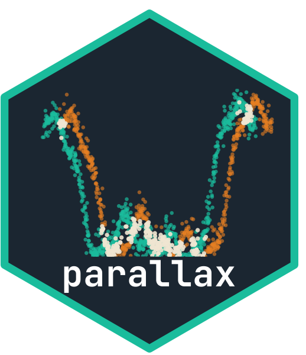

[](https://www.gnu.org/licenses/gpl-3.0)
[](https://github.com/chrislyonsKY/parallax/actions/workflows/R-CMD-check.yml)
<!-- [](https://CRAN.R-project.org/package=parallax) -->
<!-- [](https://CRAN.R-project.org/package=parallax) -->


# parallax 

**Multi-platform point cloud analysis for R — registration, segmentation, surface reconstruction, and feature extraction for aerial, terrestrial, and UAV LiDAR.**

R has `lidR` for aerial LiDAR processing and it's excellent — but it was designed for overhead perspective at moderate point densities. Throw a terrestrial laser scan at 50,000 pts/m² at it and things get awkward. Give it a UAV photogrammetric point cloud with oblique angles and variable density and you're fighting the assumptions. There's no R package that treats acquisition platform as a first-class concept, where ground classification, segmentation, and reconstruction automatically adapt their parameters based on whether you're working with aerial, terrestrial, or UAV data.

**parallax** fills that gap. One API, platform-aware defaults, Rust-powered performance where it counts, pipe-friendly outputs that work naturally with the tidyverse.

Documentation is published at <https://chrislyonsky.github.io/parallax/>.

## Install

```r
# install.packages("pak")
pak::pak("chrislyonsKY/parallax")
```

Requires a Rust toolchain for building from source. Binary packages (when available from CRAN or R-universe) don't require Rust.

## Quick start

```r
library(parallax)

# Use the installed demo files for a quick tour
aerial_path <- system.file("extdata", "aerial-demo.csv", package = "parallax")
source_path <- system.file("extdata", "registration-source.csv", package = "parallax")
target_path <- system.file("extdata", "registration-target.csv", package = "parallax")

aerial <- px_read(aerial_path, platform = "aerial")
source <- px_read(source_path, platform = "terrestrial")
target <- px_read(target_path, platform = "terrestrial")

# Filtering and segmentation
filtered <- px_filter_statistical(aerial, k = 6, std_ratio = 1.5)
ground <- px_classify_ground(filtered)
trees <- px_segment_trees(filtered, min_height = 2.0, crown_threshold = 0.75)
metrics <- px_metrics(filtered)

# Registration
icp <- px_icp(source = source, target = target, max_correspondence_distance = 2.0)

# Surface reconstruction
target <- px_estimate_normals(target, k_neighbors = 4L)
mesh <- px_poisson_reconstruct(target, depth = 4L)
```

The same files back the package vignettes in [`vignettes/getting-started.Rmd`](vignettes/getting-started.Rmd) and [`vignettes/platform-aware-workflows.Rmd`](vignettes/platform-aware-workflows.Rmd).

## Platform-aware types

| Platform | Class | Typical density | Default ground params |
|---|---|---|---|
| Aerial | `px_aerial` | 2–25 pts/m² | CSF 2.0m cloth, nadir perspective |
| Terrestrial | `px_terrestrial` | 1,000–100,000 pts/m² | CSF 0.5m cloth, oblique-aware |
| UAV | `px_uav` | 20–500 pts/m² | CSF 1.5m cloth, variable density |

## Features

**Registration** — ICP (point-to-point, point-to-plane), coarse alignment (FPFH + RANSAC), multi-scan `px_align_scans()`

**Segmentation** — ground classification (CSF, PMF, platform-aware), object segmentation (DBSCAN, region growing), tree delineation (watershed, Li2012)

**Surface reconstruction** — Poisson (watertight), Ball Pivoting, alpha shapes

**Feature extraction** — RANSAC plane/cylinder detection, edge detection

**Filtering** — voxel downsample, statistical outlier removal, radius outlier, crop

**Metrics** — summary statistics, canopy height model, point density maps

## Examples and articles

- Repo scripts live in [`examples/quickstart.R`](examples/quickstart.R) and [`examples/registration-reconstruction.R`](examples/registration-reconstruction.R)
- Installed demo files are documented in [`inst/extdata/README.md`](inst/extdata/README.md)
- Long-form walkthroughs live in [`vignettes/getting-started.Rmd`](vignettes/getting-started.Rmd) and [`vignettes/platform-aware-workflows.Rmd`](vignettes/platform-aware-workflows.Rmd)

## Architecture

Rust core (via `extendr`) for performance-critical operations. R layer for the type system, pipe-friendly API, and platform-aware dispatch. All `px_*` functions accept any `px_cloud` subtype.

### lidR interop

```r
las <- to_lidr(cloud)           # parallax → lidR
cloud <- from_lidr(las)         # lidR → parallax
```

## Companion: occulus (Python)

[**occulus**](https://github.com/chrislyonsKY/occulus) provides the same capabilities with Python-native idioms. C++ core via pybind11. Same concepts, same algorithm names, independent implementation.

| | **parallax** (R) | **occulus** (Python) |
|---|---|---|
| Core | Rust via extendr | C++ via pybind11 |
| Returns | S3/S7 classes, tibbles | NumPy arrays |
| Interop | lidR, sf, terra | Open3D, laspy |
| Registry | CRAN | PyPI |

## Development

```r
# Clone and install from source
git clone https://github.com/chrislyonsKY/parallax.git
cd parallax
# In R:
devtools::install()
devtools::test()
devtools::check()
pkgdown::build_site()
```

## License

GPL-3.0 — see [LICENSE](LICENSE).

## Author

**Chris Lyons** — GIS Developer, Kentucky Energy & Environment Cabinet
- GitHub: [@chrislyonsKY](https://github.com/chrislyonsKY)
- Email: chris.lyons@ky.gov
